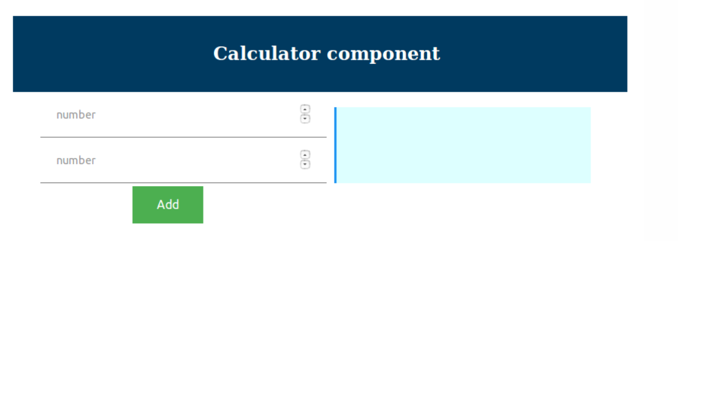
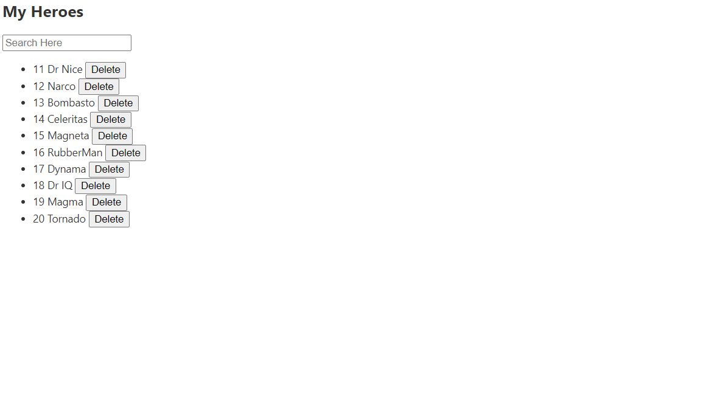
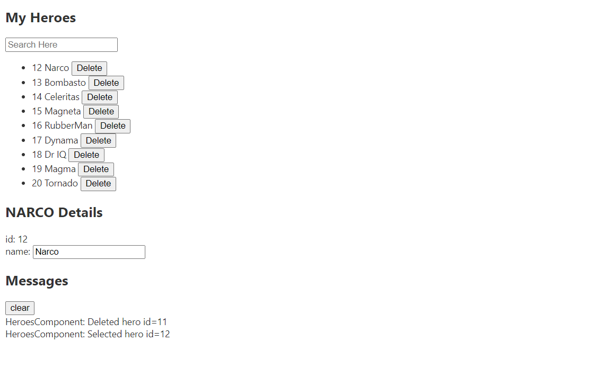
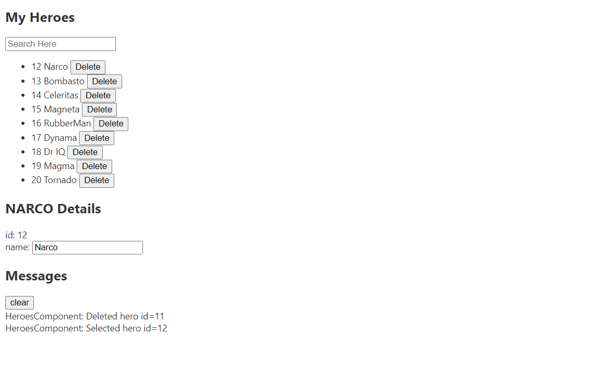
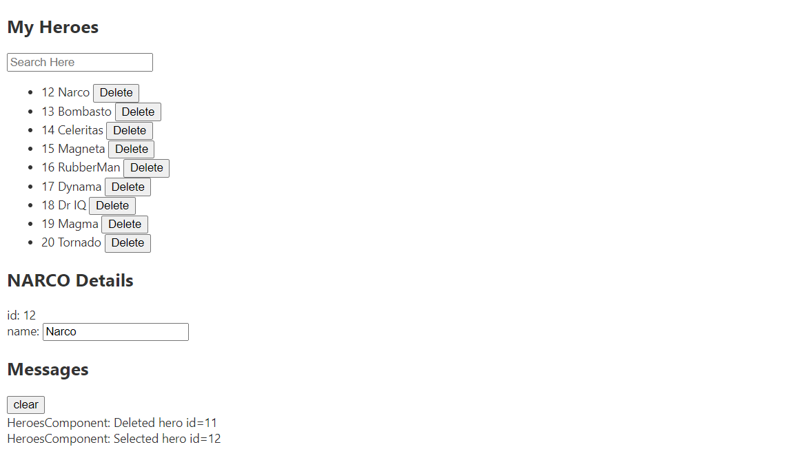

### :camel: Angular examples
---

#### Task1: Create a component to display Hello World

```

ng generate component helloworld

app-routing.module.ts

import { NgModule } from '@angular/core';
import { Routes, RouterModule } from '@angular/router';
import { HelloworldComponent } from './helloworld/helloworld.component';

const routes: Routes = [
  { path: 'hello', component: HelloworldComponent }
];

@NgModule({
  imports: [RouterModule.forRoot(routes)],
  exports: [RouterModule]
})
export class AppRoutingModule { }

app.component.html
<router-outlet></router-outlet>


```

#### Task2: Create angular component calculator



```
app.module.ts
import { BrowserModule } from '@angular/platform-browser';
import { NgModule } from '@angular/core';

import { AppComponent } from './app.component';
import { CalcComponent } from './calc/calc.component'
import { FormsModule } from '@angular/forms';

@NgModule({
  declarations: [
    AppComponent,
    CalcComponent
  ],
  imports: [
    BrowserModule,
    FormsModule
  ],
  providers: [],
  bootstrap: [AppComponent]
})
export class AppModule { }

app.component.ts 

import { Component } from '@angular/core';

@Component({
  selector: 'app-root',
  templateUrl: './app.component.html',
  styleUrls: ['./app.component.css']
})
export class AppComponent {
  title = 'app';
}

app.component.html
<!--The content below is only a placeholder and can be replaced.-->
<div style="text-align:center">
  <calc></calc>
</div>

calc.component.html
<div class="container">
	<div class="header">
		<h2>
			Calculator component
		</h2>	
	</div>

	<div class="grid">
		<div class="row">
			<div class="col-6">
				<div class="operation">
					<div class="row">
						<div class="col-12">
							<input [(ngModel)]="number1" type="number" name="" placeholder="number">
						</div>
					</div>
					<div class="row">
						<div class="col-12">
							<input [(ngModel)]="number2" type="number" name="" placeholder="number">
						</div>
					</div>
					<div>
						<div class="col-12">
							<button (click)="add()" class="button">
								Add 
							</button>
						</div>
					</div>
				</div>
			</div>
			<div class="col-6">
				<div class="result">
					<span>
						Result : {{result}}
					</span>
				</div>
			</div>
		</div>
	</div>
</div>

calc.component.ts 

import { Component } from '@angular/core';

@Component({
  selector: 'calc',
  templateUrl: 'calc.component.html',
  styleUrls: ['calc.component.css']
})
export class CalcComponent {
  public number1 : number;
  public number2 : number;
  public result : number;

  public add(){
  	this.result = this.number1 + this.number2
  }
}
```

#### Task3: Create a component to display the heros list as shown below



```
https://github.com/fullstackproj/angular-hero-app

useful commands

ng new angular-hero-app

ng g c heroes
ng g c hero-detail
ng g c messages

npm i ng2-search-filter --save

```


#### Task4: Create a component to handle the messages



```

useful commands

ng new angular-hero-app

ng g c heroes
ng g c hero-detail
ng g c messages

npm i ng2-search-filter --save

```

#### Task5: Create a component to handle the hero details



```

useful commands

ng new angular-hero-app

ng g c heroes
ng g c hero-detail
ng g c messages

npm i ng2-search-filter --save

```

#### Task5: Create a component to handle the delete



```

useful commands

ng new angular-hero-app

ng g c heroes
ng g c hero-detail
ng g c messages

npm i ng2-search-filter --save

```
