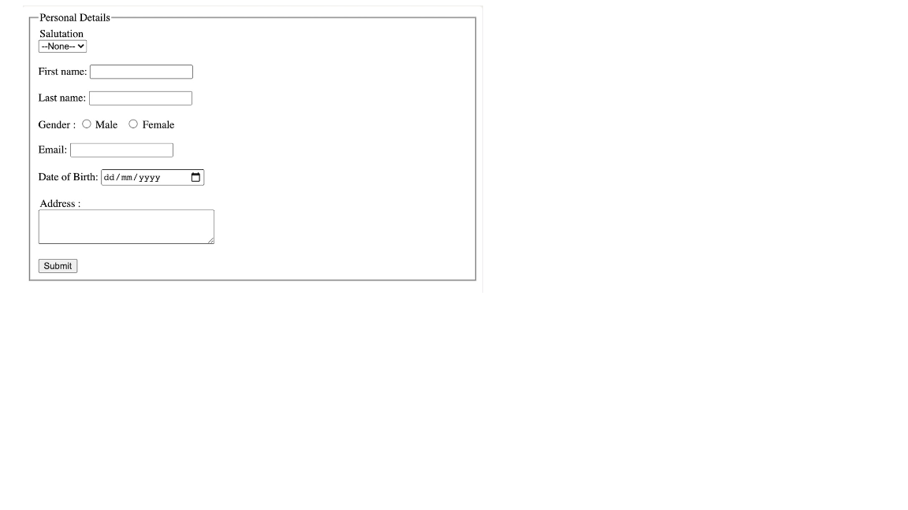

### :camel: HTML examples
---

#### Task1: Create the below form using HTML


```
<!DOCTYPE html>
<html>
<head>
<title>Page Title</title>
</head>
<body>
<h2>Welcome To GFG</h2>
<form>
	

<p>
	<label>Username : <input type="text" /></label>
	</p>


	

<p>
	<label>Password : <input type="password" /></label>
	</p>


	

<p>
	<button type="submit">Submit</button>
	</p>


</form>
</body>

```

#### Task2: Create the below form using HTML


```
<!DOCTYPE html>
<html>
<head>
<title>Page Title</title>
</head>
<body>
<h2>Select your gender</h2>
<form>
	<label>Male<input type="radio" name="gender" value="male" /></label>
	<label>Female<input type="radio" name="gender" value="female" /></label>
</form>
</body>
</html>

```

#### Task3: Create the below form using HTML


```
<!DOCTYPE html>
<html>
<head>
<title>Page Title</title>
</head>
<body>
<h2>Choose Language</h2>
<form>
	<ul style="list-style-type:none;">
	<li><input type="checkbox" name="language" value="hindi" />Hindi</li>
	<li><input type="checkbox" name="language" value="english" />English</li>
	<li><input type="checkbox" name="language" value="sanskrite" />Sanskrit</li>
	</ul>
</form>
</body>
</html>

```

#### Task4: Create the below form using HTML


```
<!DOCTYPE html>
<html>
<head>
<title>Page Title</title>
</head>
<body>
<h2>Select Your Nationality</h2>
<form>
<select name="language">
	<option value="indian">Indian</option>
	<option value="nepali">Nepali</option>
	<option value="others">Others</option>
</select>
</form>
</body>
</html>
```

#### Task5: Create the below form using HTML



```
<!DOCTYPE html>
<html lang="en">
<head>
<meta charset="UTF-8">
<meta http-equiv="X-UA-Compatible" content="IE=edge">
<meta name="viewport" content="width=device-width, initial-scale=1.0">
<title>GfG</title>
</head>
<body>
<form>
	<fieldset>
	<legend>Personal Details</legend>
	

<p>
		<label>
		Salutation
		<br />
		<select name="salutation">
			<option>--None--</option>
			<option>Mr.</option>
			<option>Ms.</option>
			<option>Mrs.</option>
			<option>Dr.</option>
			<option>Prof.</option>
		</select>
		</label>
	</p>


	

<p>
		<label>First name: <input name="firstName" /></label>
	</p>


	

<p>
		<label>Last name: <input name="lastName" /></label>
	</p>


	

<p>
		Gender :
		<label><input type="radio" name="gender" value="male" /> Male</label>
		<label><input type="radio" name="gender" value="female" /> Female</label>
	</p>


	

<p>
		<label>Email:<input type="email" name="email" /></label>
	</p>


	

<p>
		<label>Date of Birth:<input type="date" name="birthDate"></label>
	</p>


	

<p>
		<label>
		Address :
		<br />
		<textarea name="address" cols="30" rows="3"></textarea>
		</label>
	</p>


	

<p>
		<button type="submit">Submit</button>
	</p>


	</fieldset>
</form>
</body>
</html>


```