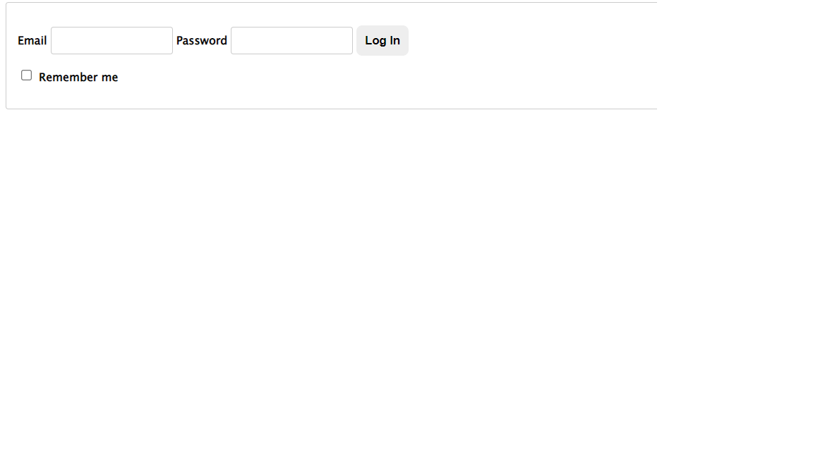
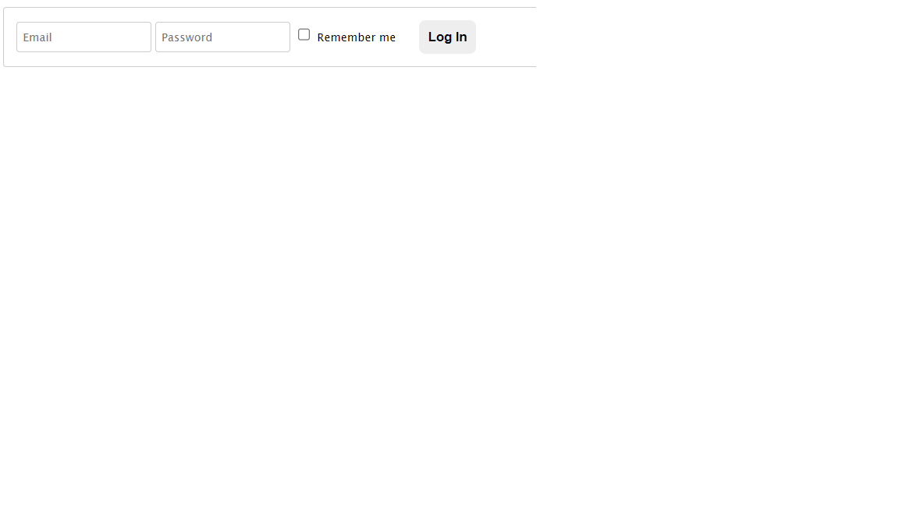
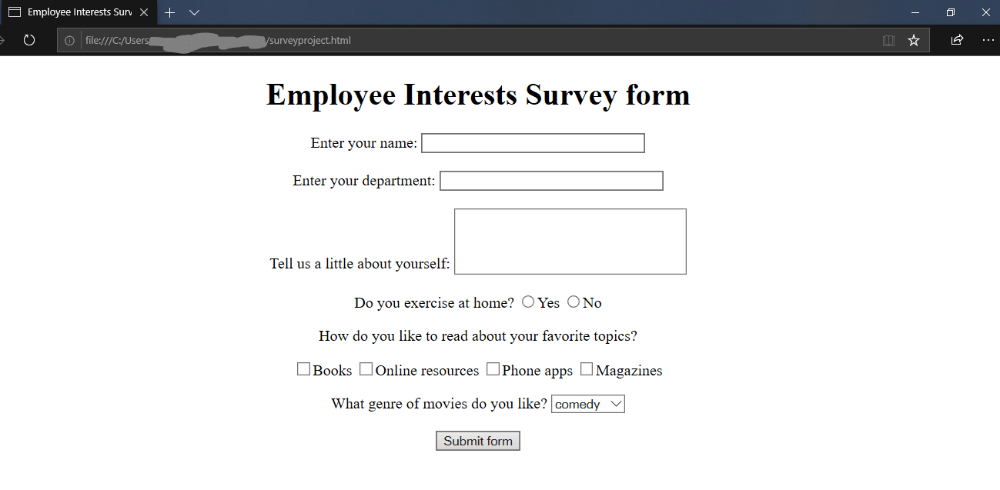
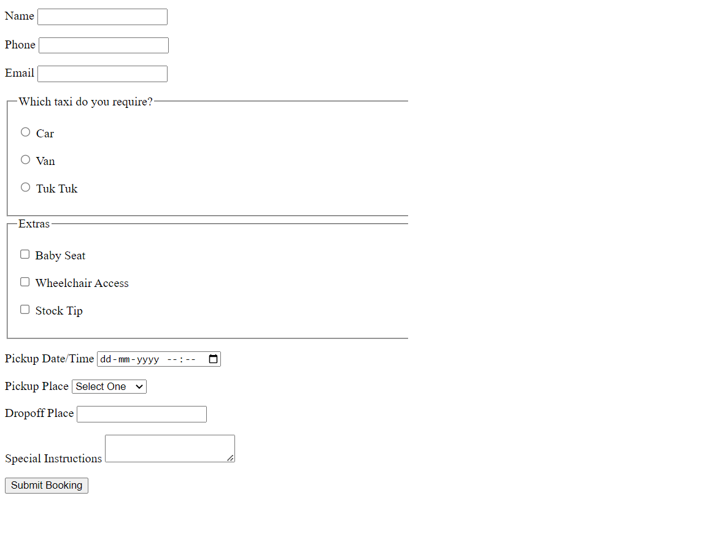

### :camel: HTML examples
---

#### Task1: Create the below form using HTML


```
<!DOCTYPE html>
<html lang="en">
<head>
<meta charset="utf-8">
<meta name="viewport" content="width=device-width, initial-scale=1">
<meta http-equiv="x-ua-compatible" content="ie=edge">
<title>My Example</title>

<!-- CSS -->
<style>
.myForm {
font-family: "Lucida Sans Unicode", "Lucida Grande", sans-serif;
font-size: 0.8em;
width: 30em;
padding: 1em;
}

.myForm * {
box-sizing: border-box;
}

.myForm label {
padding: 0;
font-weight: bold;
text-align: right;
display: block;
}

.myForm input,
.myForm select,
.myForm textarea {
margin-left: 2em;
float: right;
width: 20em;
border: 1px solid #ccc;
font-family: "Lucida Sans Unicode", "Lucida Grande", sans-serif;
font-size: 0.9em;
padding: 0.3em;
}

.myForm textarea {
height: 100px;
}

.myForm button {
padding: 1em;
border-radius: 0.5em;
background: #eee;
border: none;
font-weight: bold;
margin-left: 14em;
margin-top: 1.8em;
}

.myForm button:hover {
background: #ccc;
cursor: pointer;
}
</style>

</head>
<body>

<form class="myForm" method="get" enctype="application/x-www-form-urlencoded" action="/html/codes/html_form_handler.cfm">

<p>
<label>Name 
<input type="text" name="customer_name" required>
</label> 
</p>

<p>
<label>Email 
<input type="email" name="email_address">
</label>
</p>
	
<p>
<label>Enquiry Regarding 
<select id="pickup_place" name="pickup_place">
<option value="" selected="selected">Select One</option>
<option value="website" >Our Website</option>
<option value="membership" >Membership</option>
<option value="telepathy" >We'll Guess!</option>
</select>
</label> 
</p>

<p>
<label>Enquiry 
<textarea name="comments" maxlength="500"></textarea>
</label>
</p>

<p><button>Submit Enquiry</button></p>

</form>

</body>
</html>

```

#### Task2: Create the below form using HTML



```
<!DOCTYPE html>
<html lang="en">
<head>
<meta charset="utf-8">
<meta name="viewport" content="width=device-width, initial-scale=1">
<meta http-equiv="x-ua-compatible" content="ie=edge">
<title>My Example</title>

<!-- CSS -->
<style>
.myForm {
font-family: "Lucida Sans Unicode", "Lucida Grande", sans-serif;
font-size: 0.8em;
padding: 1em;
border: 1px solid #ccc;
border-radius: 3px;
}

.myForm * {
box-sizing: border-box;
}

.myForm label {
padding: 0;
font-weight: bold;
}

.myForm input {
border: 1px solid #ccc;
border-radius: 3px;
font-family: "Lucida Sans Unicode", "Lucida Grande", sans-serif;
font-size: 0.9em;
padding: 0.5em;
}

.myForm input[type="email"],
.myForm input[type="password"] {
width: 12em;
}

.myForm button {
padding: 0.7em;
border-radius: 0.5em;
background: #eee;
border: none;
font-weight: bold;
}

.myForm button:hover {
background: #ccc;
cursor: pointer;
}
</style>

</head>
<body>

<form class="myForm" method="get" enctype="application/x-www-form-urlencoded" action="/html/codes/html_form_handler.cfm">

<p>
<label>Email 
<input type="email" name="user_email" required>
</label> 

<label>Password 
<input type="password" name="user_pwd" required>
</label>

<button>Log In</button>
</p>

<p>
<label>
<input type="checkbox"> Remember me
</label>
</p>

</form>

</body>
</html>

```

#### Task3: Create the below form using HTML



```
<!DOCTYPE html>
<html lang="en">
<head>
<meta charset="utf-8">
<meta name="viewport" content="width=device-width, initial-scale=1">
<meta http-equiv="x-ua-compatible" content="ie=edge">
<title>My Example</title>

<!-- CSS -->
<style>
.myForm {
font-family: "Lucida Sans Unicode", "Lucida Grande", sans-serif;
font-size: 0.8em;
padding: 1em;
border: 1px solid #ccc;
border-radius: 3px;
}

.myForm * {
box-sizing: border-box;
}

.myForm label {
font-size: 0.9em;
}

.myForm .audioOnly {
position: absolute;
width: 1px;
height: 1px;
padding: 0;
margin: -1px;
overflow: hidden;
clip: rect(0, 0, 0, 0);
border: 0;
}

.myForm input {
border: 1px solid #ccc;
border-radius: 3px;
font-family: "Lucida Sans Unicode", "Lucida Grande", sans-serif;
font-size: 0.9em;
padding: 0.5em;
}

.myForm input[type="email"],
.myForm input[type="password"] {
width: 12em;
}

.myForm button {
padding: 0.7em;
border-radius: 0.5em;
background: #eee;
border: none;
font-weight: bold;
margin-left: 1.5em;
}

.myForm button:hover {
background: #ccc;
cursor: pointer;
}
</style>

</head>
<body>

<form class="myForm" method="get" enctype="application/x-www-form-urlencoded" action="/html/codes/html_form_handler.cfm">

<label class="audioOnly" for="user_email">Email</label> 
<input type="email" name="user_email" required placeholder="Email">

<label class="audioOnly" for="user_pwd">Password</label> 
<input type="password" name="user_pwd" required placeholder="Password">

<label>
<input type="checkbox"> Remember me
</label>

<button>Log In</button>

</form>

</body>
</html>

```

#### Task4: Create the below form using HTML



```
<!DOCTYPE HTML>
<!-- This is how HTML comments look like -->
<html>
<!-- the title will appear on the page-->
<head>
<title>Employee Interests Survey</title>
</head>
<body>
<!-- as it is a survey form, we will need to submit the details, hence we use form -->
<!-- We can give absolute url, or relative url like /nextpage.jsp, and specify POST or GET method -->
<form action="http://google.co.in">
<!-- If we remove this, every thing will move to the left of the page-->
<div align="center">
<!--Adds a heading to the form-->
<h1>Employee Interests Survey form</h1>
Enter your name:
<!-- Input type text for small texts, specify size -->
<input type="text" name="UserName" size=35 maxlength=35 value="">
<!--Adds spaces - remove and see what happens -->
</br></br>
Enter your department:
<input type="text" name="Deptt" size=35 maxlength=35 value=""> </br> </br>
Tell us a little about yourself:
<!-- For writing lot of text like descriptions with text wrapping,
if you dont want text wrapping, you can add wrap = "off" (horizontal scrollbar -->
<textarea name="Comments" cols=30 rows=4></textarea> </br> </br>
Do you exercise at home?
<!-- Radio buttons help you choose one out of the many values -->
<input type="radio" name="exe" value=1>Yes
<input type="radio" name="exe" value=2>No
</p>
How do you like to read about your favorite topics?
<p>
<!--Checkbox lets you select multiple options -->
<input type="checkbox" name="Books">Books
<input type="checkbox" name="Web">Online resources
<input type="checkbox" name="Phone">Phone apps
<input type="checkbox" name="Magazines">Magazines
</p>
What genre of movies do you like?
<!--Select box lets you choose one of the multiple dropdown options-->
<select name="moviepref" ><option>
<option value=1 selected = "true">comedy
<option value=2 >romance
<option value=3 >thriller
<option value=4 >horror
<option value=5 >biopic
</select>
</br></br>
<!--submits the information entered in the form by the user -->
<input type=submit value="Submit form">
</div>
</form>
</body>
</html>

```

#### Task5: Create the below form using HTML


```
<!DOCTYPE html>
<title>My Example</title>

<form method="get" enctype="application/x-www-form-urlencoded" action="/html/codes/html_form_handler.cfm">

<p>
<label>Name
<input type="text" name="customer_name" required>
</label> 
</p>

<p>
<label>Phone 
<input type="tel" name="phone_number">
</label>
</p>

<p>
<label>Email 
<input type="email" name="email_address">
</label>
</p>

<fieldset>
<legend>Which taxi do you require?</legend>
<p><label> <input type="radio" name="taxi" required value="car"> Car </label></p>
<p><label> <input type="radio" name="taxi" required value="van"> Van </label></p>
<p><label> <input type="radio" name="taxi" required value="tuktuk"> Tuk Tuk </label></p>
</fieldset>

<fieldset>
<legend>Extras</legend>
<p><label> <input type="checkbox" name="extras" value="baby"> Baby Seat </label></p>
<p><label> <input type="checkbox" name="extras" value="wheelchair"> Wheelchair Access </label></p>
<p><label> <input type="checkbox" name="extras" value="tip"> Stock Tip </label></p>
</fieldset>

<p>
<label>Pickup Date/Time
<input type="datetime-local" name="pickup_time" required>
</label>
</p>
	
<p>
<label>Pickup Place
<select id="pickup_place" name="pickup_place">
<option value="" selected="selected">Select One</option>
<option value="office" >Taxi Office</option>
<option value="town_hall" >Town Hall</option>
<option value="telepathy" >We'll Guess!</option>
</select>
</label> 
</p>

<p>
<label>Dropoff Place
<input type="text" name="dropoff_place" required list="destinations">
</label>

<datalist id="destinations">
<option value="Airport">
<option value="Beach">
<option value="Fred Flinstone's House">
</datalist>
</p>

<p>
<label>Special Instructions
<textarea name="comments" maxlength="500"></textarea>
</label>
</p>

<p><button>Submit Booking</button></p>

</form>
```